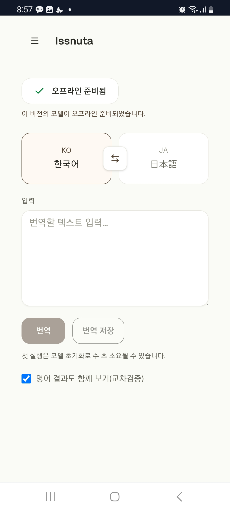
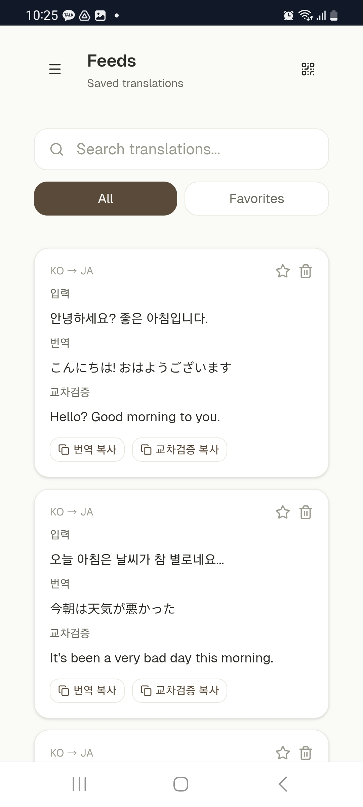
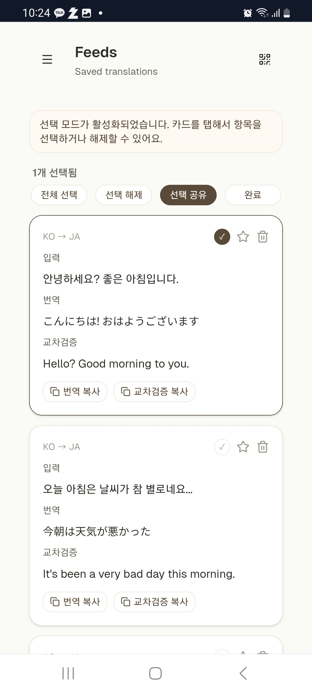

# Issnuta

[English](./README.md)

한국어, 영어, 일본어를 지원하는 모바일 우선 오프라인 번역 PWA입니다.

<p align="center">
  
  &nbsp;&nbsp;
  
  &nbsp;&nbsp;
  
</p>
<p align="center">
  <b>번역</b>&nbsp;&nbsp;·&nbsp;&nbsp;<b>피드</b>&nbsp;&nbsp;·&nbsp;&nbsp;<b>선택 모드</b>
</p>

Issnuta는 [Transformers.js](https://huggingface.co/docs/transformers.js)와 [ONNX Runtime Web](https://onnxruntime.ai/docs/tutorials/web/)을 사용하여 브라우저에서 직접 번역 모델을 실행합니다. 인터넷 연결 없이도 텍스트를 번역할 수 있습니다.

## 주요 기능

- **오프라인 번역** — 네트워크 없이 한↔영, 한↔일 번역 가능
- **PWA 지원** — 기기에 설치하여 네이티브 앱처럼 사용
- **사용자 제어 업데이트** — 간단한 다이얼로그로 업데이트 시점 선택
- **모바일 우선 UI** — 스마트폰과 터치 인터랙션에 최적화

## 기술 스택

- [Next.js 15](https://nextjs.org/) (App Router)
- [React 19](https://react.dev/)
- [TypeScript](https://www.typescriptlang.org/)
- [Tailwind CSS 4](https://tailwindcss.com/)
- [Serwist](https://serwist.pages.dev/) (Service Worker / PWA)
- [Transformers.js](https://huggingface.co/docs/transformers.js) + [ONNX Runtime Web](https://onnxruntime.ai/)
- [TanStack Query](https://tanstack.com/query) (데이터 페칭 / 캐싱)
- [React Hook Form](https://react-hook-form.com/) + [Zod](https://zod.dev/) (폼 처리)
- [idb](https://github.com/jakearchibald/idb) (IndexedDB 래퍼)
- [qrcode](https://github.com/soldair/node-qrcode) (QR 코드 생성)

## 시작하기

### 사전 요구사항

- Node.js 23 이상
- [pnpm](https://pnpm.io/)

### 설치

1. 저장소 클론

   ```sh
   git clone https://github.com/nwleedev/issnuta.git
   cd issnuta
   ```

2. 의존성 설치

   ```sh
   pnpm install
   ```

3. 개발 서버 시작

   ```sh
   pnpm dev
   ```

4. 브라우저에서 [http://localhost:3000](http://localhost:3000) 열기

### 프로덕션 빌드

```sh
pnpm build
pnpm start
```

### 테스트 실행

```sh
pnpm test
```

## 페이지

| 경로          | 설명                                                  |
| ------------- | ----------------------------------------------------- |
| `/`           | 언어 선택과 텍스트 입력이 있는 메인 번역 인터페이스   |
| `/feeds`      | 저장된 번역 목록 (검색, 필터링, QR 코드 공유)         |
| `/feeds/scan` | 공유된 번역을 가져오는 QR 코드 스캐너                 |
| `/offline`    | 캐시된 콘텐츠 없이 오프라인일 때 표시되는 폴백 페이지 |

## 프로젝트 구조

```
app/           → Next.js App Router 페이지 및 레이아웃
entries/       → 진입점 (providers, 공유 UI 래퍼)
shared/        → 공유 유틸리티 및 UI 컴포넌트
  ├── lib/     → 훅, 헬퍼, 비즈니스 로직
  └── ui/      → 재사용 가능한 UI 컴포넌트
```

## 동작 방식

1. **첫 방문** — 선택한 언어쌍에 맞는 번역 모델 다운로드
2. **오프라인 모드** — 캐시된 후에는 인터넷 없이 번역 가능
3. **업데이트** — 새 버전이 있으면 업데이트 시점을 선택할 수 있는 다이얼로그 표시

## 라이선스

이 프로젝트는 MIT 라이선스로 배포됩니다.
